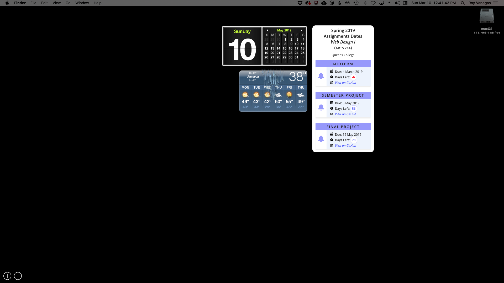

# Assignments Dates (macOS Widget)

## What is This?
A macOS widget that students in my courses can use to note the amount of days left before all assignments are due.

## How Does it Work?
1. Clone this repo.
2. In GitHub Desktop, check out the branch associated with your course.
3. Locate the widget in The Finder: `⌘` `⇧` `A`.
4. Double-click `Assignment-Dates.wdgt`.

## Enable Your Dashboard
If Dashboard isn’t enabled, open System Preferences, choose **Mission Control**, then choose **As Space** or **As Overlay** next to the **Dashboard** section.

## Launching Dashboard
Type `F12`. If you’re using a MacBook Pro with Touch Bar, type `fn`, which should bring up `F12` on the Touch Bar.

## Using The Widget
In Dashboard, type `⌘` + `R` to re-calculate the assignment dates.
